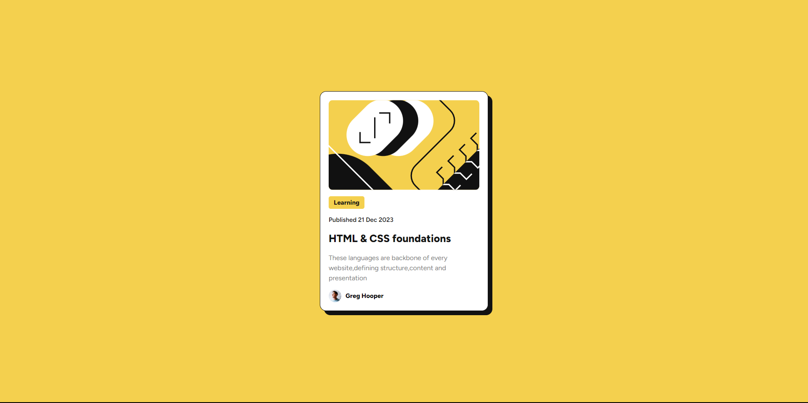

# Frontend Mentor - Blog preview card solution

This is a solution to the [Blog preview card challenge on Frontend Mentor](https://www.frontendmentor.io/challenges/blog-preview-card-ckPaj01IcS). Frontend Mentor challenges help you improve your coding skills by building realistic projects.

Users should be able to:

- See hover and focus states for all interactive elements on the page

### Screenshot




### Built with

- Semantic HTML5 markup
- CSS custom properties
- Flexbox
- Desktop-first workflow

### What I learned

```css
.card {
  display: flex;
  flex-direction: column;
  align-items: start;
  gap: 1.5rem;

  max-width: 40rem;

  background-color: var(--clr-neutral-1);

  border: 1px solid var(--clr-neutral-3);
  border-radius: 1.5rem;

  padding: 2rem;

  box-shadow: 10px 10px 0px var(--clr-neutral-3);

  transition: box-shadow 0.3s ease-in-out;

  cursor: pointer;
}
```


## Author

- Frontend Mentor - [@HugoHurleyy](https://www.frontendmentor.io/profile/HugoHurleyy)
- Twitter - [@sukrutnrvd](https://www.twitter.com/sukrutnrvd)


